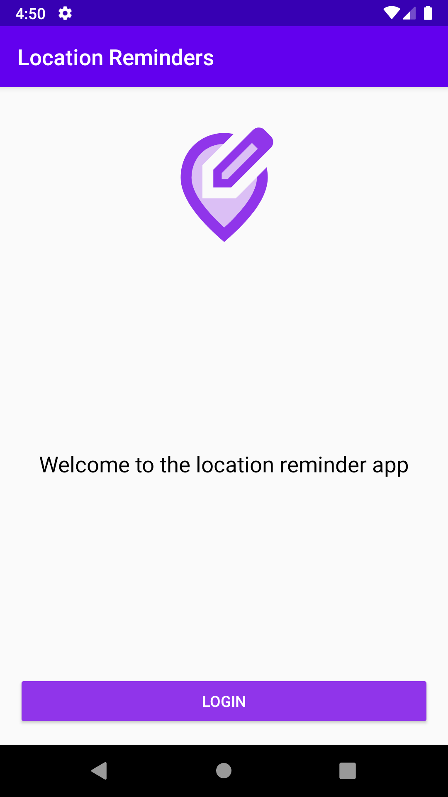
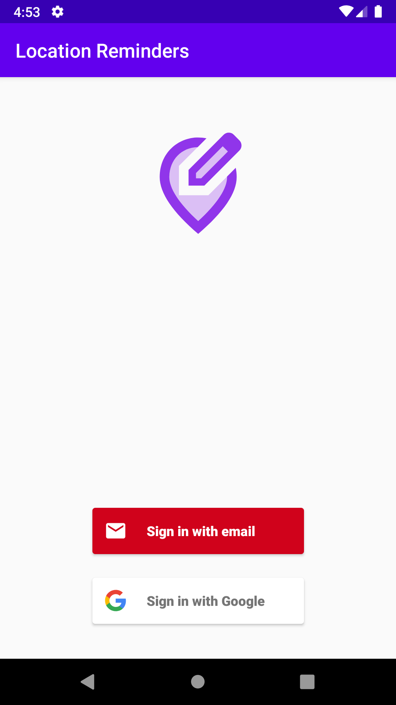
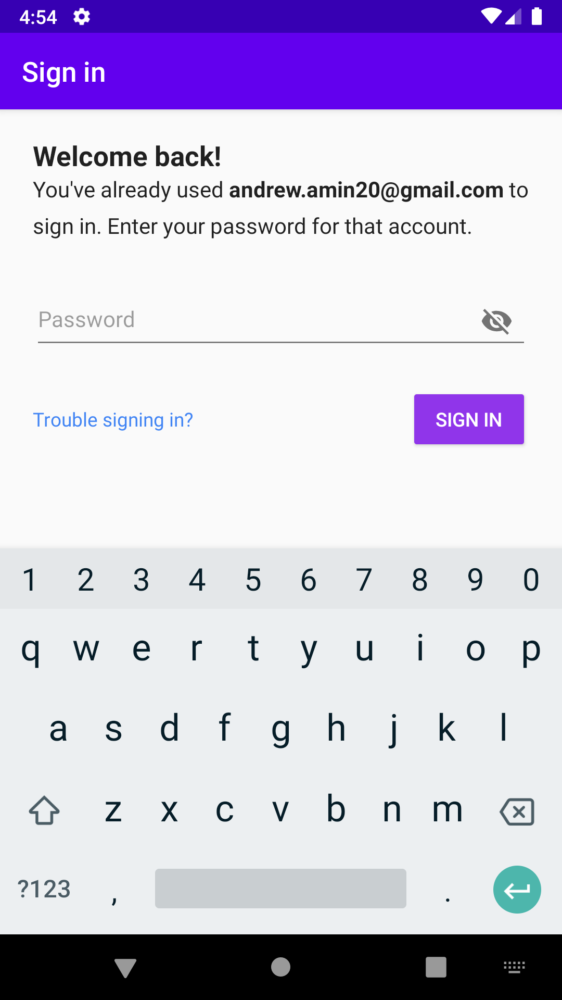
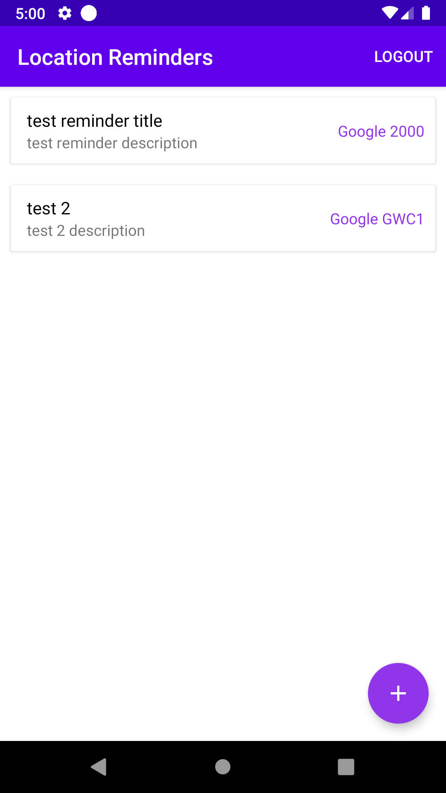
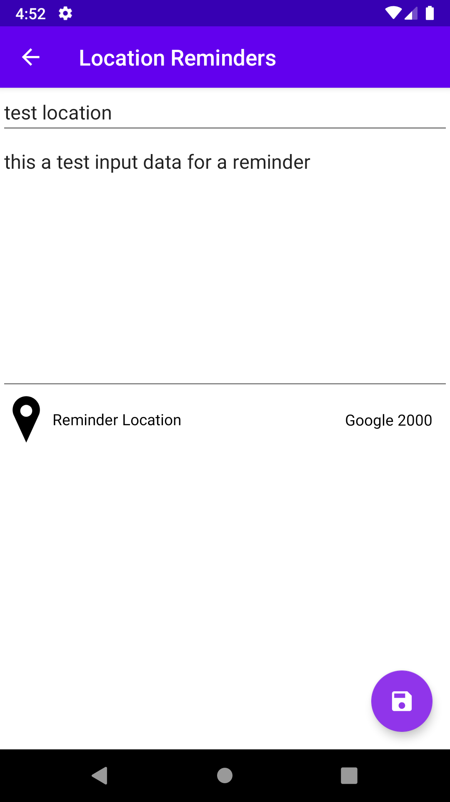
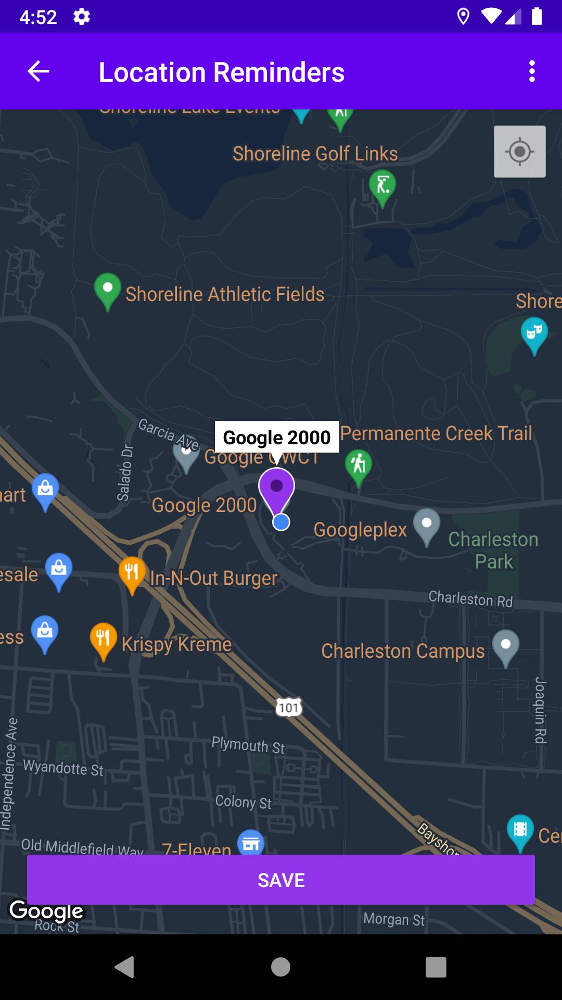
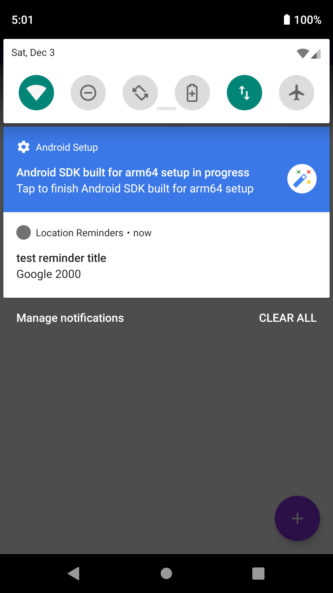
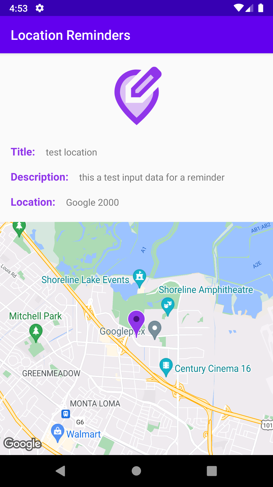

# Location Reminder

A Todo list app with location reminders that remind the user to do something when he reaches a specific location. The app will require the user to create an account and login to set and access reminders.

  
  
  

    
  
  

    
  

## Built With

* [Koin](https://github.com/InsertKoinIO/koin) - A pragmatic lightweight dependency injection framework for Kotlin.
* [FirebaseUI Authentication](https://github.com/firebase/FirebaseUI-Android/blob/master/auth/README.md) - FirebaseUI provides a drop-in auth solution that handles the UI flows for signing
* [JobIntentService](https://developer.android.com/reference/androidx/core/app/JobIntentService) - Run background service from the background application, Compatible with >= Android O.

## License
